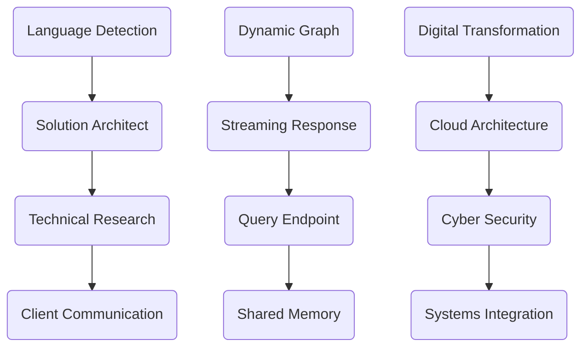

# Features Development Flowchart

```mermaid
flowchart TD
A(Language Detection)-->B(Solution Architect)
B-->C(Technical Research)
C-->D(Client Communication)

E(Dynamic Graph)-->F(Streaming Response)
F-->G(Query Endpoint)
G-->H(Shared Memory)

I(Digital Transformation)-->J(Cloud Architecture)
J-->K(Cyber Security)
K-->L(Systems Integration)
``` 